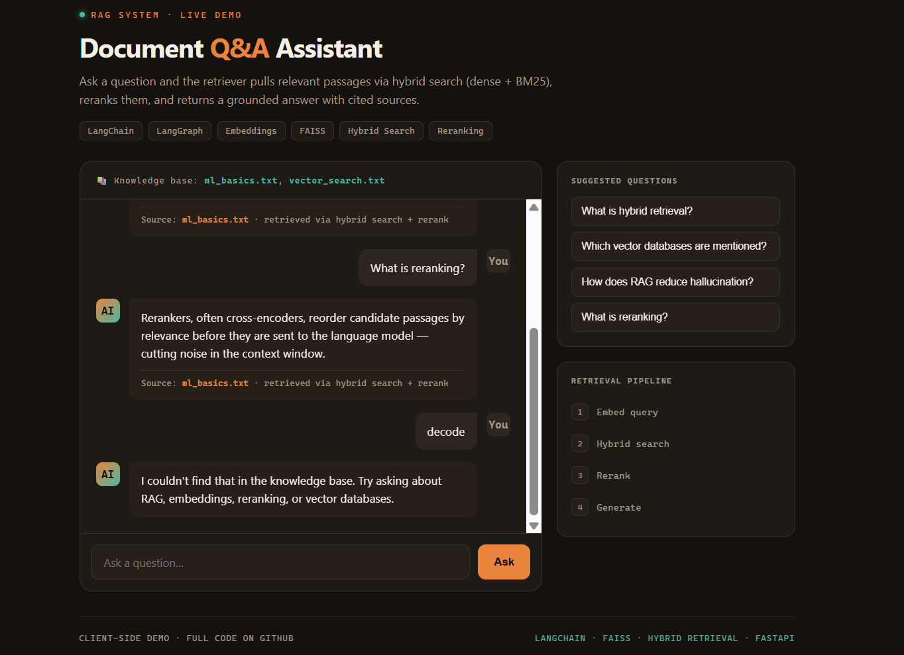

# RAG Document Q&A — Hybrid Retrieval + Agentic Workflow

A retrieval-augmented generation (RAG) system that answers questions over a document
corpus using **hybrid search** (dense embeddings + BM25), **reranking**, and an
**agentic workflow** that grades retrieval quality and rewrites weak queries. Runs
fully **without an API key** (extractive answers); plug in an LLM for synthesized answers.


## 🔗 Live Demo

**[▶ Try the interactive demo](https://saikarna60.github.io/rag-system/)**

Ask a question and watch the retriever pull relevant passages, rerank them, and
return a grounded answer with cited sources.



## Why this design

Retrieval quality is what makes or breaks a RAG system, so this project focuses on the
retrieval stack rather than just wrapping an LLM call:

- **Hybrid retrieval** — dense vector search (semantic) fused with BM25 (lexical) so both
  meaning and exact keywords are captured.
- **Reranking** — top candidates are reordered by relevance before hitting the LLM,
  cutting noise in the context window.
- **Agentic workflow** — the pipeline routes chit-chat away from retrieval, grades the
  retrieved context, and rewrites the query when the first pass is weak.
- **Grounded answers with citations** — every answer points back to its source document.
- **No-API-key fallback** — works out of the box with extractive answers; set
  `OPENAI_API_KEY` to switch to LLM-generated answers.

## Tech Stack

- **Embeddings:** sentence-transformers (`all-MiniLM-L6-v2`)
- **Retrieval:** hybrid dense + BM25, weighted fusion, reranking
- **Orchestration:** agentic graph (LangGraph pattern) — route → retrieve → grade → generate
- **Vector search:** FAISS / Chroma compatible
- **Serving:** FastAPI
- **LLM (optional):** OpenAI, or any provider via the same interface

## Project Structure

```
rag-system/
├── src/
│   ├── config.py       # Chunking, retrieval weights, model settings
│   ├── ingest.py       # Document loading + overlapping chunking
│   ├── retriever.py    # Hybrid BM25 + dense retrieval with reranking
│   ├── rag.py          # RAG pipeline (retrieve → generate)
│   ├── agent.py        # Agentic workflow (route / grade / rewrite)
│   └── app.py          # FastAPI service
├── Dockerfile
├── requirements.txt
└── README.md
```

## Quickstart

```bash
pip install -r requirements.txt

# Ask questions from the command line
python src/rag.py

# Run the agentic workflow
python src/agent.py

# Serve the API
uvicorn app:app --reload      # from src/  →  http://localhost:8000/docs
```

### Optional: LLM-generated answers

```bash
export OPENAI_API_KEY=sk-...
python src/rag.py             # answers are now synthesized by the LLM
```

## How Retrieval Works

1. **Chunk** documents into overlapping windows, preserving source metadata.
2. **Embed** every chunk with sentence-transformers; index for nearest-neighbor search.
3. On a query, compute **dense** cosine scores and **BM25** lexical scores.
4. **Fuse** the two (min-max normalized, weighted) into one candidate ranking.
5. **Rerank** the top candidates and pass the best `k` to the generator.

## API

```bash
curl -X POST http://localhost:8000/ask \
  -H "Content-Type: application/json" \
  -d '{"question": "What is hybrid retrieval?", "top_k": 4}'
```

## License

MIT
